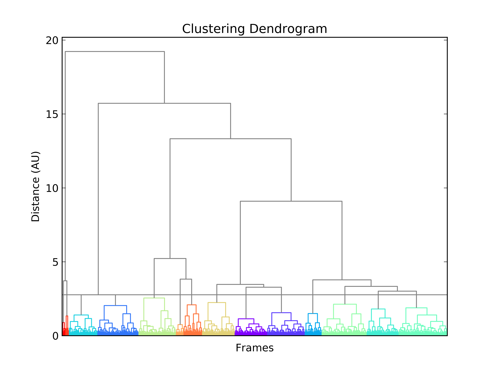
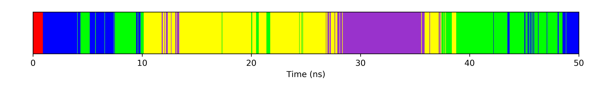
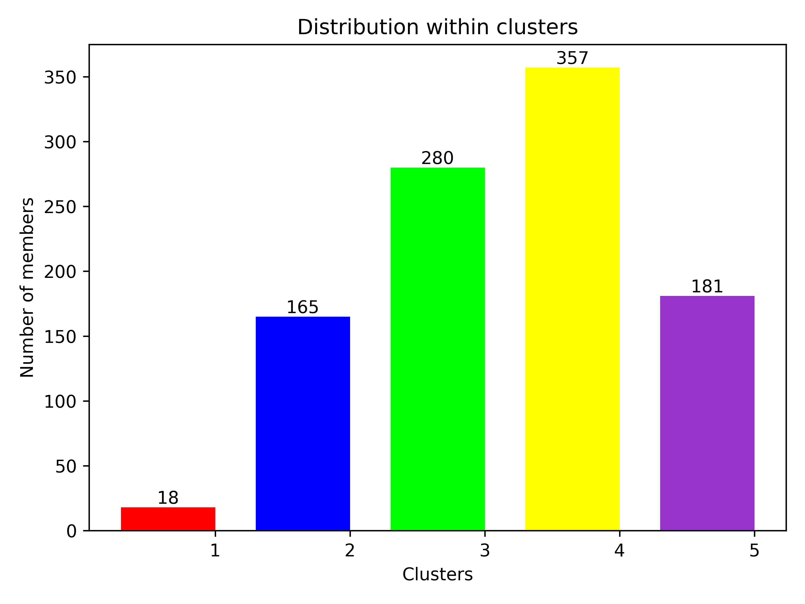
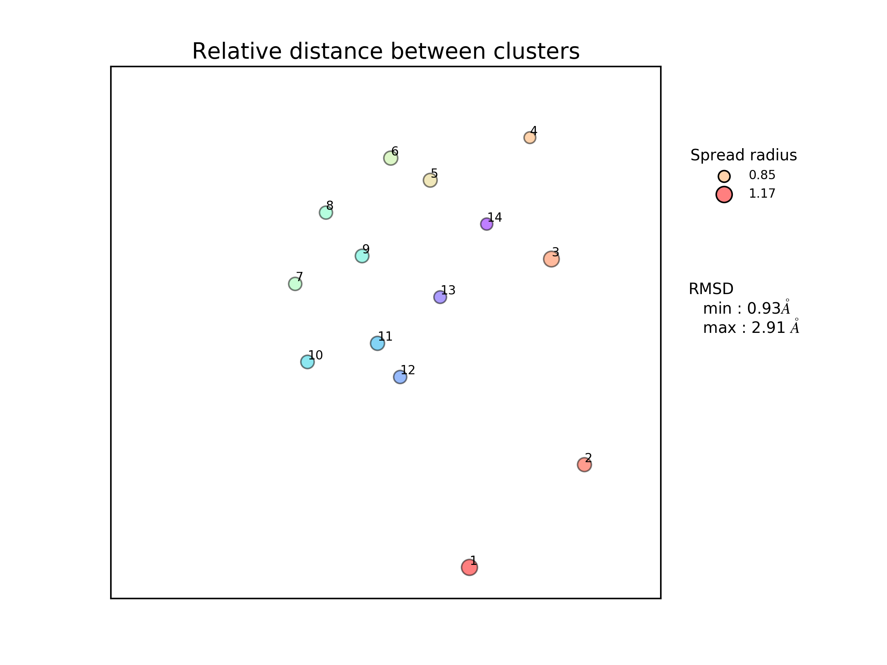
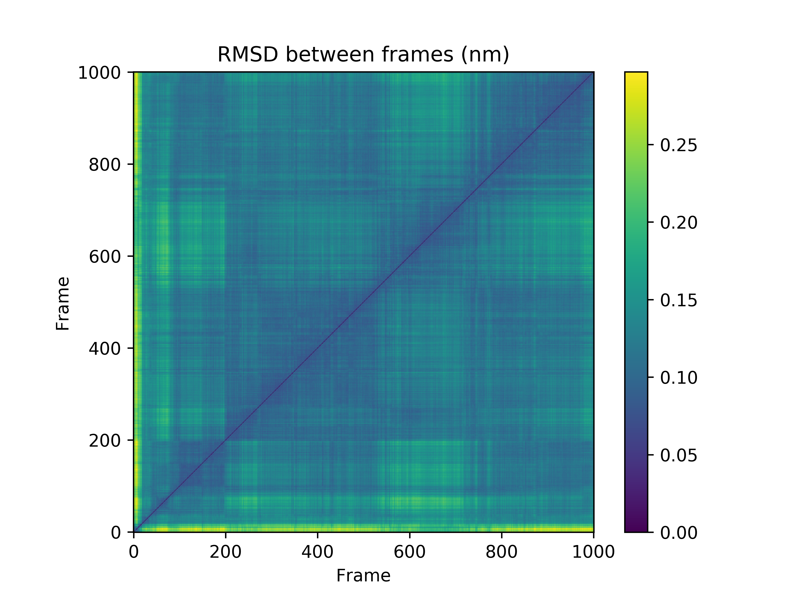

[](https://doi.org/10.1021/acs.jcim.8b00512)


# TTClust : A molecular simulation clustering program

---
## DESCRIPTION
TTclust is a python program used to clusterize molecular dynamics simulation trajectories. It only requires a trajectory and a topology file (compatible with most molecular dynamic packages such as Amber, Gromacs, Chramm, Namd or trajectory in PDB format thanks to the MDtraj package).
Easy to use, the program produces a visual feedback of the clustering through a dendrogram graph. Other graphic representations are made to describe all clusters (see OUTPUT EXAMPLE part for more details).

## Python Compatibility 
This program is compatible with python 2.7.x and 3.x.
You can have a warning for matplotlib with python 3.x but the program still works


##GUI
If you want to use a Graphical User Interface instead, you can install `ttclustgui` after `ttclust` (using `pip`).  
Link to the GUI : https://github.com/tubiana/ttclustGUI

## Installation

### Instalation with Conda
If you want an easy installation of ttclust, I suggest these steps: 

1. If you don't have conda (or Python) installed, Install miniconda (https://docs.conda.io/en/latest/miniconda.html) (with Python3, it's the future...)
2. Install with the command `conda install -c tubiana -c conda-forge ttclust`

### Instalation with PIP
1. Install numpy and cython with pip : `pip install cython numpy`
2. Install ttclust `pip install ttclust`

 I strongly suggest you to use conda because pip will compile mdtraj and increase the the chance that the install fails (cgg/microsoft visual C++ library....).
 
### Installation & usage from sources

1. Clone this repo `git clone https://github.com/tubiana/ttclust`
2. Install dependancies:
   - Using pip (and use python environment system)  
 `sudo pip install -r requirements.txt`
 
   - using conda, suggested (and use a virtual conda environment, leaving your python installation untouched)  
`conda env create -f environment.yml`
     - Don't forget to activate environement with `conda activate ttclust`

3. Use ttclust scripts with `python {PATH}/ttclust/ttclust.py` or `python {PATH}/ttclust/ttclustGUI.py`

**Note** : sometimes mdtraj is hard to install. If you use PIP, please install manually cython before in this case `sudo pip install cython` then `sudo pip install -r requirements.txt`.  
If you have still issues in installing mdtraj, you can install it with conda with `conda install mdtraj`


### Possibles issues
##### For CentOS user
If you have issues with pip, I suggest you install ANACONDA and restart your terminal afterwards.
Then, you need to install wxPython with conda `conda install wxPython`.
Finally, you can use the PIP commmand: `sudo pip install -r requirements.txt`

##### For Windows user
If you have issues with pip installing mdtraj (Microsoft Visual C++ Build Tools missing), I also suggest you install ANACONDA and restart yout terminal afterwards.
Then, you can mdtraj with conda `conda install mdtraj`.
Finally, you can use the PIP commmand: `sudo pip install -r requirements.txt`

**NOTE** if ttclust was installed with pip, ttclustGUI will not work due to the gooey package (I hope it will be fixed soon..)  
But you can still use the GUI with the script by cloning this repo and execute `ttclustGUI.py` 

##### For Mac user
If you have issues with pip, first try to add to pip the `--ignore-installed` argument : `sudo pip install --ignore-installed -r requirements.txt`
If it still doesn't work, it's maybe because of the System Integrity Protection (SIP).
I suggest you in this case install **ANACONDA** or **MINICONDA** and restart your terminal afterwards. 
Normally, the pip command should work because your default python will be the anaconda (or miniconda) python.

If you have still issues with the GUI or missing packages : install with pip :   
`pip install wxpython==4.0.0b1`    
`pip install pandas`    
`pip install ttclust`

To activate autocompletion for the argpase module, you have to use this command 
(only once): `sudo activate-global-python-argcomplete`

## Dependancies and installation: 
Following packages are needed: 
  - argparse
  - argcomplete (for autocompletion, optional)
  - cython (for mdtraj)
  - mdtraj (version >= 0.17)
  - progressbar
  - datetime *(a python library standard)*
  - glob *(a python library standard)*
  - matplotlib
  - scipy (version >= 0.18)
  - prettytable
  - sklearn (version >= 0.18)
  - RXPY>=0.1.0 (FOR GUI)
  - wxpython>=4.0.0b1 (FOR GUI)
  - Pillow>=4.3.0 (FOR GUI)
  - psutil>=5.4.2 (FOR GUI)
  - gooey (FOR GUI)

#### Atoms selection
For Selection syntax, use the one from MDTraj (http://mdtraj.org/1.9.3/atom_selection.html).
You can specify different selections for the calculation: 
 - **st** is used to extract a part of the trajectory (if this one is too big).
 ..* leave this blank if you want to keep your trajectory intact.
 - **sa** used to align your trajectory on the same reference (eg: a chain or 
 ..* the backbone) 
 - **sr** is used for the clustering (rmsd calculated on the atom selected with 
 ..* this string)
 
#### NOTE on Nucleic Acids
MDTRAJ doesn't have nucleic acid keywords yet. We've implemented some keywords that will be altered to match DNA/RNA....
Keywords added : 
 - **dna** : selection based on the residue name (DA/DT/DC/DG)
 - **rna** : selection based on the residue name (A/T/G/C or RA/RT/RG/RC)
 - **backbone_na** : backbone of nucleic acid. Selection based on the residue name and atom name (P, O3', O5', C3', C4', C5')
 - **base** : selection base on the residue name and atom name. Select RNA or DNA and exclude backbone_na, sugar's atoms and hydrogen
 - **base_rna** : same as *base* but for RNA
 - **base_dna** : same as *base* but for DNA

 Those selection keywords can be used with other MDTRAJ selection keywords, e.g.:
 - "protein and not dna"
 - "rna and not type H"

 
#### Clustering Methods
With the scipy module, several methods for clustering are available. Change the 
method used with the *-m* argument. Methods available are: 
 - single
 - complete
 - average
 - weighted
 - centroid
 - median
 - **ward** (DEFAULT)

4 possibilities  are available for the calculation: 

1. **Autoclustering** (default method). The autoclustering uses the elbow method to find the optimum cluster numbers.
2. Give the number of clusters you want. Eg: if you want 3 clusters, use the argument  
**-ng 3**
3. Give a cutoff for the clustering. The final clusters are made from a dendrogram and this cutoff is used for the distance cutoff. If you want to
..* set this cutoff manually, use the argument  
**-cc x.x** (x.x is the cutoff)
4. Choose your cutoff by clicking on the matplotlib windows (on the dendrogram) in this case don't use the other arguments. **recommended for the first 
 clustering**
 

#### Distance Matrix
The distance matrix can be long to calculate depending on your trajectory size.
That's why this matrix is saved on the ".npy" format, in order to be used later.
The name of the matrix will be the name of your selection string for clustering (*sr*)
If you use the same selection string for clustering (*sr*) the matrix will be detected
and the programme will ask you if you want to use it again (Y), recalculate this
matrix (N) or choose another matrix (O). If you want to use the saved matrix without
this interactive question) add in argument **-i n** which will deactivate
the interactive prompt.


## ARGUMENTS 
```text
  -h, --help            show this help message and exit
  -f TRAJ, --traj TRAJ  trajectory file(s). You can give a list of trajectory (see usage example)
  -t TOP, --top TOP     topfile
  -s INT, --stride INT  stride, read every Xth frames
  -o OUTPUT, --output OUTPUT (default: clustering.log)
                        logfile 
  -st SELECT_TRAJ, --select_traj SELECT_TRAJ (default: all)
                        selection syntax for trajectory extraction, with QUOTE 
  -sa SELECT_ALIGNEMENT, --select_alignement SELECT_ALIGNEMENT (default: backbone)
                        selection syntax for alignement with QUOTE
						If you don't want alignement: use "none"
  -sr SELECT_RMSD, --select_rmsd SELECT_RMSD (default: backbone)
                        selection syntax for RMSD with QUOTE 
  -m METHOD, --method METHOD (default: ward)
                        method for clustering: single; complete; average;
                        weighted; centroid; median and ward
  -cc CUTOFF, --cutoff CUTOFF
                        cutoff for clusterization from hierarchical clusturing
                        with Scipy. If you choose to click on the graph, cutoff
                        will be the clicked value 
  -ng NGROUP, --ngroup NGROUP
                        number of group wanted. Use the maxclust method to
                        clusterize in this case. If you specify "auto", kmeans clustering
						with the elbow algorithm is used to find the optimal number of
						clusters
  -aa AUTOCLUST, --autoclust AUTOCLUST
                        By default, autoclustering is activated. Autoclustering is desactivated
                        when specifiying anything other than "Y", a cutoff value ('-cc') or a 
                        number of group ('-ng') 
  -i INTERACTIVE, --interactive INTERACTIVE
                        Interactive mode for distance matrix (Y/n)
  -axis AXIS, --axis AXIS
                        if something is wrong in the axis of timed barplot
                        graph (wrong time unit), and you just want 'frame'
                        instead of time Choose 'frame' here.
  -limitmat LIMITMAT, --limitmat LIMITMAT
                        If the distance matrix is too long to generate choose
                        a limit here. Default is 100000000
```
    
## USAGE: 
There is some example usage with the examples files given on the "example" folder. 
Please note that the trajectory is reduced to the backbone in order to reduce the size of the git archive.
Caution: You have to put quote beside your selection string (for *sr*, *st*, and *sa* arguments) 
 - Simple usage (clustering on backbone, logfile is called clustering.log, output folder is "clustering")
 ```python ttclust.py -f examples/example.xtc -t examples/example.pdb```
  - Simple usage with reading every 10 frames
 ```python ttclust.py -f examples/example.xtc -t examples/example.pdb -s 10```
  - Simple usage with multiple trajectories  
 ```python ttclust.py -f traj1.xtc traj2.xtc  -t examples/example.pdb```  
 ```python ttclust.py -f *.xtc  -t examples/example.pdb```
 - Clustering on residues 30 to 200 and backbone
 ```python ttclust.py -f examples/example.xtc -t examples/example.pdb -sr "residue 30 to 200 and backbone" -l res30-200.log```
 - Clustering on CA atoms and save this part of the trajectory with a cutoff of 2.75
 ```python ttclust.py -f examples/example.xtc -t examples/example.pdb -sr "name CA" -st "name CA" -cc 2.75 -l CA-c2.75.log```
 - Clustering on backbone of the protein and chain A (note that with mdtraj there is no chaine's name, but chaine ID starting from 0) with 10 clusters only
 ```python ttclust.py -f examples/example.xtc -t examples/example.pdb -sr "protein and backbone and chainid 0" -l backbone-chainA.log -ng 10 ```
- Note For PDB trajectory, don't use the **-t** argument
```python TrajectoryClustering.py -f traj.pdb -st "protein" -sr "backbone"```

#### NB (For Mac User)
You need to use pythonw instead of python.


## OUTPUT EXAMPLE
#### Cluster result (structure)
PDBs are saved in a new folder Cluster_PDB.  
You can find in the PDB name the *cluster number*, *size* and the *representative frame*
of the cluster (*ie* the frame number of the saved structure)  
Example: C1-f11-s44.pdb corresponds to the cluter 1 made of 44 structures and the
saved frame (representative) is the frame 11.

#### Logfile
In the log file you will find all arguments given to the program with
cluster information:
 - **size**: number of structures in the cluster
 - **representative frame**: frame with lowest RMSD between all other frames of the cluster
 - **Members**: all frames belonging to the cluster
 - **spread**: mean RMSD between all frames in the cluster
 - **RMSD between clusters**: A tab with the RMSD between clusters
 - **Average RMSD between clusters**: the average RMSD between clusters.

#### Dendrogram
A dendrogram is generated at the end of the clustering with the corresponding cluster colors.
The name of this file will be the same as the logfile with a ".png" extension. 
example: example.log --> example.png
  
The grey horizontal line is the cutoff value used.


#### LinearProjection representation
A linear projection of cluster is made for the trajectory.

Every barline represents a frame and the color a cluster number.
Note that: 
 - If less or equal than 12 clusters: a defined color map was made in this order:
   red, blue, lime, gold, darkorchid, orange, deepskyblue, brown, gray, black, darkgreen, navy
 - Else, the matplotlib "hsv" color map is used but the color change according to
   the number of clusters.

#### Barplot representation
A vertical barplot is generated to have an overview of the cluster size. Each bar color corresponds to the cluster's color in the LinearProjection's representation and dendrogram cluster's color.


#### 2D distance projection
A 2D projection of the distance(RMSD) between the representative frame of each cluster is made. The method used is the multidimentional scaling method from the sk-learn python module.

We can follow the evolution of each cluster thanks to the relative distance between them. The color of the points is the same as for other graphs (i.e. cluster's color) and the radius of each point depends on the cluster's spread.

#### Distance matrix plot
A plot of the distance matrix is also made and allows to easily visualize the distance between two frames. 



#CITATION
If you use TTclust in a publication, please use this citation  
  
Tubiana, T., Carvaillo, J.-C., Boulard, Y., & Bressanelli, S. (2018). TTClust: A Versatile Molecular Simulation Trajectory Clustering Program with Graphical Summaries. Journal of Chemical Information and Modeling, 58(11), 2178–2182. https://doi.org/10.1021/acs.jcim.8b00512


## Licence
This program is under the GNU GPLv3 licence, which means that anyone who 
distributes this code or a derivative work has to make the source available under 
the same terms, and also provides an express grant of patent rights from 
contributors to users.
